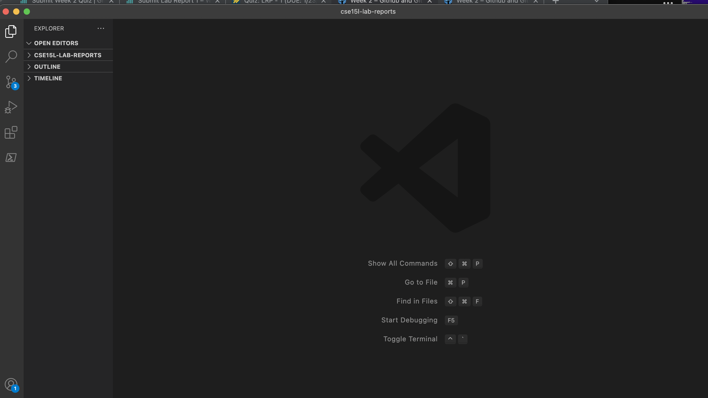
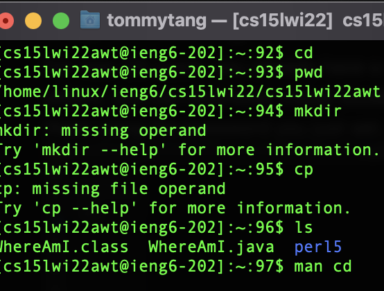
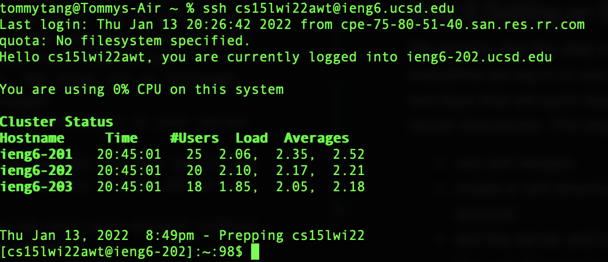

# Steps to log onto your ieng6 account
## Step 1: Find your 15L account information
Go to this [link](https://sdacs.ucsd.edu/~icc/index.php) to find your account. Then change your password and wait for a couple of minutes for the password to reset.

## Step 2 Installing VScode
For mac OS users, you already have a terminal on your desktop. For others, you can download Visual Studio Code via [here](https://code.visualstudio.com/download) and log on the terminal there using the password you just set. 

## Step 3 remotely connecting
The ssh user name should be `ssh cs15lwi22xxx@ieng6.ucsd.edu`.
Then type in the password you just reset.

## Step 4 Trying Some Commands
Try commands such as `pwd, mkdir, cp, cd, ls, man cd`. What is the output of terminal?

## Step 5 Moving Files with scp
Now exit the server. We want to use scp command to move file from your local to the server. We can do that by:

`scp file + username:~/`

## Step 6 Setting an SSH Key
We want to skip the step of typing password everytime we log in or use scp. This is to create two keys that are each stored in your local and server directories. The steps are as followed:
* use ssh-keygen
* create a .ssh directory in your server account
* exit the server and scp your public key to the .ssh directory in your server account
Now you can log onto your account without typing your password

## Step 7 Optimizing Remote Running 
* you can run ssh command while running accounts with <kbd>""</kbd>

* we can also run mutiple commands with <kbd>;</kbd> separted with each command. For example, we can try <kbd>cd; ls ; ls -a</kbd>

